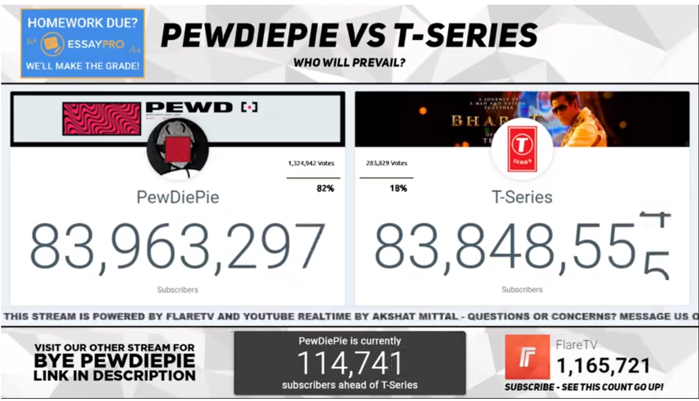

## PewDiePie Vs. T-Series

Create a webpage showing live subcriber count for the ongoing subcriber war between the King of Youtube, PewDiePie and Corporate Giant, T-Series. Be a part of this battle and maintain the record of daily subcriber count.

You can use Google's Youtube API v3 for getting live subscriber count based on Channel Name/ID. 

## Requirements:
* The site should show the live subscriber count of PewDiePie and T-Series

* The site should be playing the song - Bitch Lasagna. There should be a mute button for it as well.

* The difference in subscriber count between the two channels should be displayed.

* There should be a rolling transition animation for the change in count.

## Sample for Reference

Participants can refer to the live sub count interface used by [FlareTV](https://www.youtube.com/watch?v=dAx1wXmpTdM).

